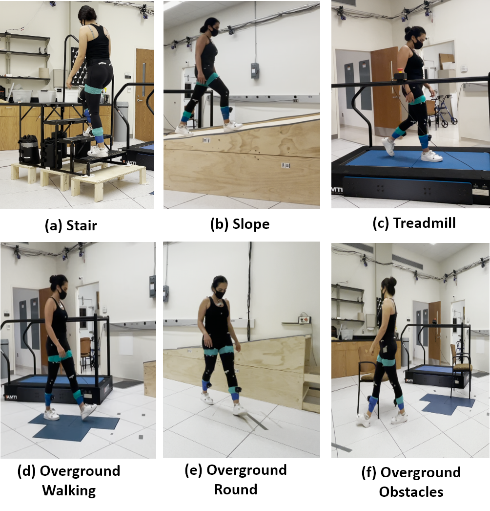
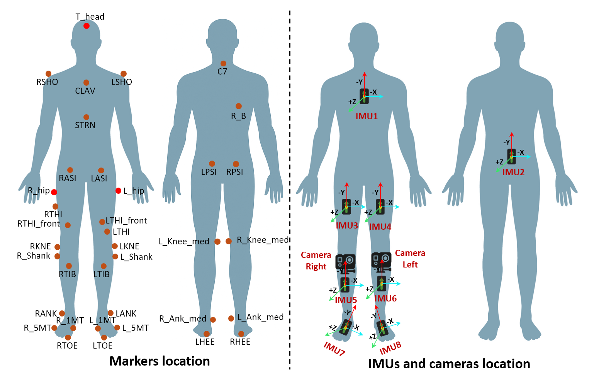
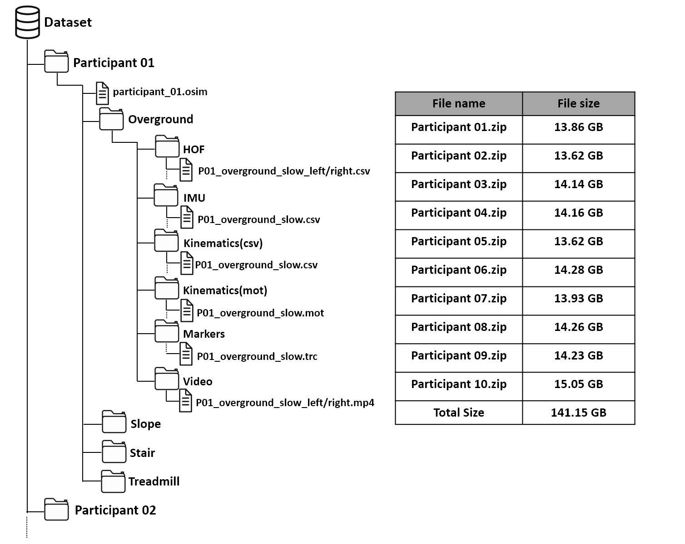

# Wearable Motion Capture Dataset for Gait Analysis

### IMUs, Shank-Mounted Egocentric Cameras, and Ground-Truth Kinematics — Dataset & Analysis Code

This repository provides the **processing, analysis, and example application code** used in the paper:

> **A Wearable Motion Capture Dataset for Gait Analysis Using IMUs and Shank-Mounted Egocentric Cameras**
> Md Sanzid Bin Hossain *et al.*

The **dataset itself is hosted separately** on Figshare and can be accessed via the link provided in the manuscript and data record.

[](YOUR_COLAB_LINK_HERE)
[](YOUR_FIGSHARE_LINK_HERE)
[](https://creativecommons.org/licenses/by/4.0/)

---

## Overview

This work introduces a **multimodal wearable motion capture dataset** designed to support both
**biomechanics** and **machine learning** research on human gait across diverse locomotion conditions.

The dataset includes synchronized data from:

| Modality | Details |
|---|---|
| **IMUs** | 8 Delsys Avanti sensors, 100 Hz, ACC + GYRO (6 ch each) |
| **Egocentric cameras** | Shank-mounted, left + right, HOF features at 30 Hz |
| **Optical motion capture** | Vicon, 12 cameras, 100 Hz, 34 reflective markers |
| **Joint kinematics** | OpenSim musculoskeletal modeling, degrees |

**10 participants** (6 Male, 4 Female, age 23.9 ± 3.1 years) performed **14 locomotion conditions**
across 6 locomotion modes.

---

## Locomotion Conditions

| Mode | Conditions | Speed |
|---|---|---|
| Treadmill | Slow, Normal, Fast, Very Fast | Froude-based per subject |
| Overground | Slow, Normal, Fast, Very Fast | Self-selected |
| Overground Special | Circular path, Obstacle avoidance | Self-selected |
| Slope | 2 repetitions (20% grade) | Self-selected |
| Stair | 2 repetitions | Self-selected |

<p align="center">
  
</p>
<p align="center">
  <em>Locomotion trial types: (a) stair, (b) slope, (c) treadmill,
  (d) overground straight, (e) overground circular, (f) obstacle avoidance.</em>
</p>

---

## Sensor & Marker Placement

<p align="center">
  
</p>
<p align="center">
  <em>Sensor and marker placement. IMUs placed on sternum, sacrum, bilateral
  thighs, shanks, and feet. Shank-mounted cameras capture egocentric
  lower-limb video from both legs. Markers follow a modified Helen Hayes set.</em>
</p>

---

## Dataset Structure

The released dataset is organized per participant with subfolders for each
locomotion mode and sensor modality. A unified HDF5 file (`gait_dataset.h5`)
is provided for efficient programmatic access.

<p align="center">
  
</p>
<p align="center">
  <em>Original folder structure (left) and file sizes (right).</em>
</p>

### HDF5 Structure
```
gait_dataset.h5
├── metadata/
│   ├── demographics/          # age, weight, height, leg length, gender
│   ├── treadmill_speeds_ms/   # Froude-based speeds per subject (m/s)
│   ├── overground_speeds_reference/  # pre-computed OG speeds
│   └── imu_sensor_map/        # sensor ID → body location mapping
│
├── participants/
│   └── P01/ ... P10/
│       └── {treadmill,overground,slope,stair}/
│           └── {condition}/
│               ├── markers/          # raw TRC data (T × n_markers*3), mm
│               ├── kinematics/       # OpenSim joint angles (T × n_joints), °
│               ├── imu/
│               │   ├── raw           # full matrix (T × 48)
│               │   └── sensor_N_label/acc, gyro  # per-sensor (T × 3)
│               └── hof/
│                   ├── left/features   # HOF features (T × 18), 30 Hz
│                   └── right/features  # HOF features (T × 18), 30 Hz
│
└── processed/
    ├── per_subject_speeds_csv   # all speeds as CSV string
    └── per_subject_speeds/      # per-column float arrays
```

### Quick Load Example
```python
import h5py
import numpy as np
import pandas as pd
from io import StringIO

with h5py.File("gait_dataset.h5", "r") as hf:

    # Demographics
    ages = hf["metadata/demographics/age"][:]

    # Raw kinematics — P01 treadmill normal
    kin    = hf["participants/P01/treadmill/normal/kinematics/data"][:]
    joints = [j.decode() for j in
              hf["participants/P01/treadmill/normal/kinematics/joint_names"][:]]

    # Raw IMU — all 8 sensors (T × 48)
    imu = hf["participants/P01/treadmill/normal/imu/raw"][:]

    # Single sensor — right foot accelerometer (T × 3)
    acc_rf = hf["participants/P01/treadmill/normal/imu/sensor_7_right_foot/acc"][:]

    # HOF features — left camera (T × 18)
    hof = hf["participants/P01/treadmill/normal/hof/left/features"][:]

    # Pre-computed speed table
    speed_df = pd.read_csv(StringIO(
        hf["processed/per_subject_speeds_csv"][()].decode()))
```

---

## Analysis Notebook

A complete reproducible analysis notebook is provided as a Google Colab notebook.
All analyses are performed directly from the HDF5 file — no raw files needed.

[](YOUR_COLAB_LINK_HERE)

### Notebook Contents

| Cell | Analysis |
|---|---|
| 1 | Setup & installation |
| 2 | Global constants & configuration |
| 3 | Dataset overview & demographics |
| 4 | Core processing functions (heel strikes, gait cycles, turn filtering) |
| 5 | Walking speed analysis — all conditions |
| 6 | Population gait cycle visualization |
| 7 | Joint ROM summary statistics |
| 8 | Test-retest reliability (ICC) |
| 9 | Speed effect on ROM (Friedman test) |
| 10 | Bilateral symmetry analysis |
| 11 | Cross-condition ROM comparison |
| 12 | Speed-ROM correlation |
| 13 | Inter-subject variability (CV + PCA) |
| 14 | **Example application: Locomotion classification** |

---

## Example Application: Locomotion Mode Classification

To demonstrate real-life dataset utilization, we implemented a
**cycle-level locomotion mode classification** task using wearable
sensor features extracted directly from the dataset.

### Setup

- **8 locomotion modes:** Treadmill, Overground, Circular, Obstacles,
  Slope Ascent/Descent, Stair Ascent/Descent
- **Classifier:** Random Forest (200 trees, balanced class weights)
- **Validation:** Leave-One-Subject-Out CV (LOSO-CV)
- **Granularity:** Per gait cycle — each stride is one sample
- **Chance level:** 12.5% (1/8 classes)

### Feature Sets

| Experiment | Features | Dim |
|---|---|---|
| ROM Baseline | Hip, Knee, Ankle ROM (R+L) | 6 |
| IMU Only | Statistical features from 8 sensors × 6 ch | 288 |
| HOF Only | Statistical features from L+R shoe cameras | 108 |
| IMU + HOF | Combined multimodal | 396 |

### Results

| Experiment | Accuracy | vs Chance |
|---|---|---|
| ROM (Kinematic Baseline) | 53.3% | +40.8% |
| IMU Only (Wearable) | 79.8% | +67.3% |
| HOF Only (Wearable Vision) | 82.1% | +69.6% |
| **IMU + HOF (Multimodal)** | **88.7%** | **+76.2%** |

Key findings:
- Multimodal fusion of IMU and HOF outperforms either modality alone
- Treadmill walking classified with **100% accuracy** by wearable sensors
- Overground path-variant conditions (circular, obstacles) are most challenging
  due to kinematic similarity with standard overground walking
- Even the simple ROM baseline achieves **4× above chance**,
  confirming the discriminative quality of the kinematic data

---

## Statistical Validation

The dataset includes comprehensive statistical analyses:

### Walking Speed
- Treadmill speeds prescribed via Froude-number scaling
  (v = Fr × √(g × L_leg)), ensuring dynamically equivalent
  walking across participants
- Overground speeds computed cycle-by-cycle from pelvis
  displacement (turn cycles excluded)

### Joint ROM
- **Test-retest reliability:** ICC(2,1) computed for slope
  and stair conditions (Rep1 vs Rep2) — predominantly
  Excellent (ICC ≥ 0.90)
- **Speed effect:** Friedman test with Wilcoxon/Bonferroni
  post-hoc — significant speed-dependent ROM increase for
  all joints on treadmill (p < 0.001, W = 0.51–1.00);
  overground knee ROM not significantly affected (p > 0.12)
- **Bilateral symmetry:** Symmetry Index < 10% across
  most conditions, confirming bilateral consistency
- **Condition comparison:** Kruskal-Wallis + Mann-Whitney
  post-hoc across 8 locomotion modes

---

## Repository Contents
```
├── analysis_notebook.ipynb    # Full Google Colab analysis notebook
├── images/
│   ├── Trial_types.png
│   ├── marker_and_sensors.png
│   └── folder_structure.png
└── README.md
```

---

## Citation

If you use this dataset or code in your research, please cite:
```bibtex
@article{hossain2024wearable,
  title   = {A Wearable Motion Capture Dataset for Gait Analysis
             Using IMUs and Shank-Mounted Egocentric Cameras},
  author  = {Hossain, Md Sanzid Bin and others},
  journal = {Scientific Data},
  year    = {2024},
}
```

---

## License

This dataset and code are released under the
[Creative Commons Attribution 4.0 International License (CC BY 4.0)](https://creativecommons.org/licenses/by/4.0/).

---

## Contact

**Md Sanzid Bin Hossain**
Postdoctoral Fellow, Center of Data Science
Nell Hodgson Woodruff School of Nursing, Emory University
